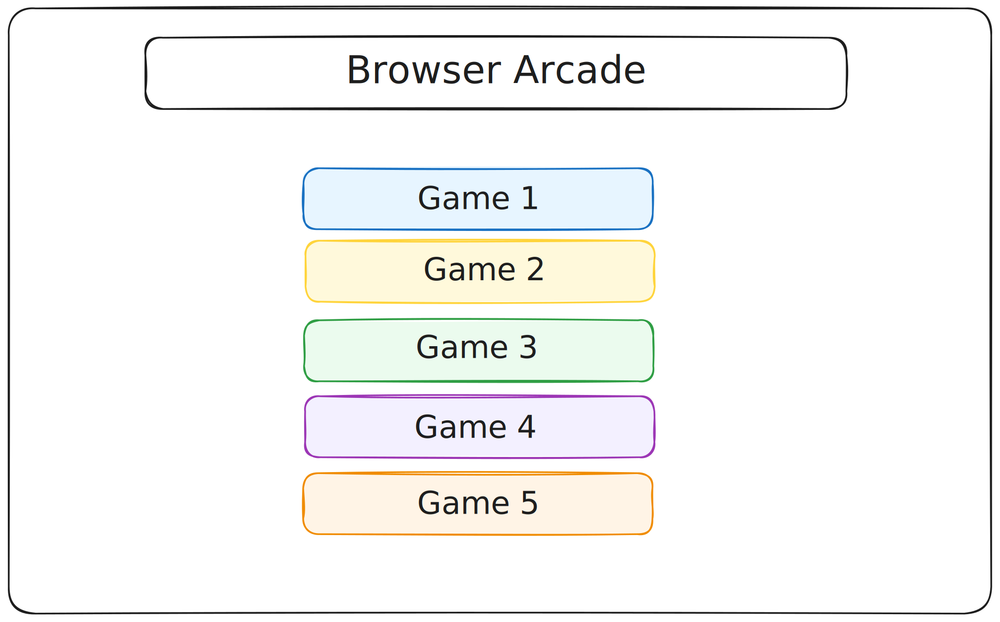

# Browser Arcade

## Overview

1. [Description](#description)
2. [Deployment Link](#deployment-link)
3. [Installation](#installation)
4. [Technologies Used](#technologies)
5. [Deliverables](#deliverables)
6. [Planning/Build Process](#planning)
7. [Challenges](#challenges)
8. [Wins](#wins)
9. [Key Learnings & Takeaways](#takeaways)
10. [Future Improvements](#future-improvements)

---

## <a name="description"></a> 1. Description

Collection of links to some browser games I created.


## <a name="deployment-link"></a> 2. Deployment link

## <a name="installation"></a> 3. Installation

- package manager used: npm (v9.5.0)
  - https://www.npmjs.com/package/npm
- to install dependencies, run:

```zsh
npm install
```

## <a name="technologies"></a> 4. Technologies Used

This application is based in ReactJS (v18.3.1) and SCSS(v^1.77.8).

- package manager: npm (v10.8.1)

  - https://www.npmjs.com/

- the app was created using the 'create-react-app' command
- https://create-react-app.dev/

```zsh
npx create-react-app .
```

### Dependencies:

- routing

  - react-router-dom (v6.23.1)
    - https://www.npmjs.com/package/react-router-dom
    - https://github.com/remix-run/react-router

- animations
  - framer-motion (v11.3.17)
    - npm: https://www.npmjs.com/package/framer-motion
    - repo: https://github.com/framer/motion
    - homepage: https://www.framer.com/motion/

### UI

- fonts:
  - 'Press Start 2P' designed by CodeMan38
    - source: [Google Fonts](https://fonts.google.com/)
    - https://fonts.google.com/specimen/Press+Start+2P
- icons:
  - iconify
    - https://icon-sets.iconify.design/
  - fontawesome
    - https://fontawesome.com/

### Additional tools used:

- Git / GitHub
  - used for version control
  - https://git-scm.com/
  - https://github.com/
- Visual Studio Code (VSCode)
  - code editor used for writing CSS, JSX and JavaScript
- Google Chrome browser
  - used for launching the website and displaying the application Google Chrome
- Google Chrome Developer Tools: For troubleshooting and debugging
  - https://www.google.com/intl/en_uk/chrome/
- chatGTP
  - https://chat.openai.com/
  - used for debugging
- Hostinger: provider used to host the game online
  - https://www.hostinger.co.uk
- Excalidraw
  - used for building the wireframe
  - https://excalidraw.com/

### Resources and tutorials:

- routing:
  - react-router docs: Migrating to RouterProvider:
    - https://reactrouter.com/en/main/upgrading/v6-data
  - blogs:
    - [The Power Of CreateBrowserRouter: Optimizing Your React App's Navigation](https://www.dhiwise.com/post/the-power-of-createbrowserrouter-optimizing-your-react-app) by Daxesh Patel
    - [Getting Started with createBrowserRouter in react-router-dom](https://medium.com/@pavitramodi.it/getting-started-with-createbrowserrouter-in-react-router-dom-e3131820fef4) by [Pavitra Modi](https://medium.com/@pavitramodi.it)
  - Youtube:
    - [React Router in Depth #3 - Router Provider, createBrowserRouter & Outlet](https://www.youtube.com/watch?v=5s57C7leXc4&pp=ygUacmVhY3QgY3JlYXRlYnJvd3NlcnJvdXRlciA%3D) by [Net Ninja](https://www.youtube.com/@NetNinja)
- page transitions
  - framer-motion docs:
    - https://www.framer.com/motion/animation/
  - Youtube:
    - [Build and Deploy a Portfolio Website Using Next JS, Tailwind CSS & Framer Motion](https://www.youtube.com/watch?v=dImgZ_AH7uA) by [Cristian Mihai](https://www.youtube.com/@cristianmihai01)
- matrix effect canvas:
  - YouTube: [Hacking Matrix Rain Effect using HTML CSS & JavaScript](https://www.youtube.com/watch?v=uIq9gmlenlA&list=PL5TCQHRtvHGkuR2YZDf_2lDFuc9m5OUlO&index=22) by [CodeCreative](https://www.youtube.com/@CodeCreativeYT)
  - YouTube: [Matrix raining code effect using HTML, CSS and Javascript](https://www.youtube.com/watch?v=y4K_5CVz7Cs&list=PL5TCQHRtvHGkuR2YZDf_2lDFuc9m5OUlO&index=21) by [JavaScript Academy](https://www.youtube.com/@JsAcademyOfficial)
- neon button hover effect (landing page):
  - [CSS Button Hover Effects | Neon Light Button Animation Effects on Hover](https://www.youtube.com/watch?v=8NMObsAKDBQ&list=PL5e68lK9hEzd81JLjU2ey6WqODkKB2xFF&index=98) by [Online Tutorials](https://www.youtube.com/@OnlineTutorialsYT)

## <a name="deliverables"></a> 5. Deliverables

### MVP

- a git repository hosted on Github, including:

  - a link to the hosted game
  - frequent commits dating back to the very beginning of the project
  - code that is well-formatted and well-commented
  - semantic markup for HTML and CSS while adhering to best practices
  - adherence to KISS (Keep It Simple Stupid) and DRY (Don't Repeat Yourself) principles

- a website with the following features:

  - links to browser games
  - links to contact information -> email, GitHub, LinkedIn and other relevant links
  - have a mobile-responsive design

### Stretch Goals

- animations
- sound effects

## <a name="planning"></a>6. Planning / Build Process

This was a solo project I built over the course of '' days.

### User Stories

- As a user, I should be able to navigate the website without effort.
- As a user, I should be able to find links to different online games easily.
- As a user, I should be able to quickly find the developer's contact information including email, LinkedIn and GitHub accounts.
- As a user, I should be able to navigate the website from any device.

### Build process

The build process for the individual games can be found in the readme file of their original repository:

- TicTacToe repo - https://github.com/katieloesch/tictactoe-react
- Hangman repo - https://github.com/katieloesch/rock-paper-scissors-react
- Rock Paper Scissors repo - https://github.com/katieloesch/simon-react
- Simon repo - https://github.com/katieloesch/hangman-react

### Day 1: 03/04/2024

- create-react-app
- react-router -> set up a route for each game
- canvas: matrix effect




I wanted the background to look like the matrix effect so I created a canvas element and some JS code for the animation.


### Day 2

### 06/06/2024

- main menu
- game buttons
- add google font

### 25/07/2024

- change folder structure to separte pages into different directory than components
- update routing from BrowserRouter, Routes, Route to createBrowserRouter, RouterProvider
- install framer motion

## 7. <a name="challenges"></a> Challenges

## 8. <a name="wins"></a> Wins

- matrix effect backdrop didn't take a lot of time to create and I was please with the result.

## <a name="takeaways"></a> 9. Key Learnings & Takeaways

## <a name="future-improvements"></a> 10. Future Improvements
